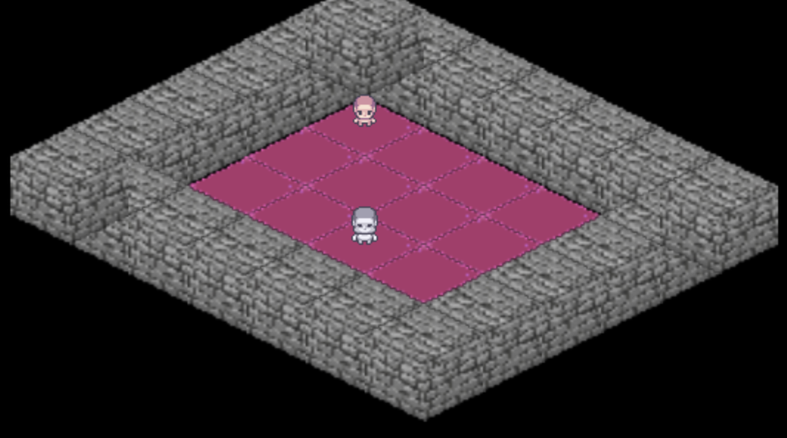

# coolgame_99
Exploring Game Dev using C++ and SDL. The task for players is to navigate a map and find the exit, whilst avoiding enemies. The game employs bounded BFS for efficient pathing with many enemies. The map is defined by the user to flexibly design levels.

This repo is a WIP, a personal project which I work on whenever I've nothing else on.

## Building
The project uses a cmake file as well as SDL3 and SDL_image libraries. To build the project, first navigate to `CMakeLists.txt` and specify the absolute path to the SDL3 and SDL_image directories.

Then, execute the following commands from the root directory.
```
rm -rf build 
cd build 
cmake ..
make
./coolgame_99
```
## Map Generation
The map is define by a text file `test.txt` located in `/data`. A user can use the following characters to define game artifacts
```
W: Wall 
P: Player 
E: Enemy 
G: Goal
' '(whitespace): Floor
```

An indicative map file is provided in the repo. 

An example map file such as : 
```
WWWWWWW
WP    W
W     W
W  E  W
W     W
WWWWWWW
```
Would form the following map: 


## Enemy Pathfinding: 
Enemy pathfinding is acheived by executing bounded BFS from each player, to some defined `depth`. Any enemies found within these bounds are directed to follow the path to target player. Pathfinding is executed periodically to update enemy pathing. 

## Collision Detection: 
Collision detection is employed using the Separating Axis Theorem (SAT). The game uses two basic shapes; Circles and Rectangles, and SAT is employed every frame to detect and rectify overlapping shapes.

## To Do: 
- Isometric textures instead of basic shapes.
- Multi Player integration.
- Fog of war. 
- Level Completion.
- Main menu.
- Restart Level.
- Enemy Status' (IDLE, CHASE, DEAD).
- Weapons.
- Multi Level Integration.

